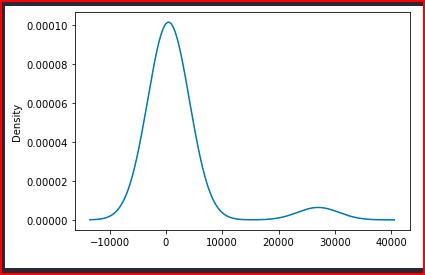

# Neural_Network_Charity_Analysis

## Project Overview

Alphabet Soup is a philantropic foundation that support environmental initiatives, improves the well being of people's lives and helps world wide initiatives for peace and unity. They have been very effective at raising and investing in livesaving technologies and reforestation initiatives around the world to the tune of 10 billion dollars in the past 20 years. However, not every donation is impactful, some groups will take the funds and be never heard from again. To ensure that donated funds are used effectively, Alpahbet Soup's management has decided to invest in technologies that will help them to predict which organizations should receive donations versus those that are high risk.

The desire is to create a mathematical data driven solution as a tool to assist in making sound decisions. As such, we are tasked with creating a deep learning neural network model which can take in all types of input data and provide a clear decision making result. We will test and optimize the results as needed to provide the best solution possible.

Using your knowledge of TensorFlow, you’ll design a neural network, or deep learning model, to create a binary classification model that can predict if an Alphabet Soup–funded organization will be successful based on the features in the dataset.

Deliverables:

1. Preprocessing Data for a Neural Network Model
2. Compile, Train, and Evaluate the Model
3. Optimize the Model
4. A Written Report on the Neural Network Model (README.md)

------------------------------------------------------------------------------------------------------------

## Resources

- Software: Visual Studio Code 1.56.2, Python 3.7.10, Jupyter Notebook Server 6.3.0
- Browser : Google Chrome v91.0.4472.124
- Libraries: imbalanced-learn v0.8.0, scikit-learn v0.24.2, tensorflow v2.6.0
- Google Collab Notebook

------------------------------------------------------------------------------------------------------------

## Results

- You’ll need to think about how many inputs there are before determining the number of neurons and layers in your model. Once you’ve completed that step, you’ll compile, train, and evaluate your binary classification model to calculate the model’s loss and accuracy.

### Read, Preprocess and Evaluate Data

What variable(s) are considered the target(s) for your model?
What variable(s) are considered to be the features for your model?
What variable(s) are neither targets nor features, and should be removed from the input data?

There is a bulleted list that answers all the above 3 questions

### Compile, train and Evaluate Model

How many neurons, layers, and activation functions did you select for your neural network model, and why?
Were you able to achieve the target model performance?
What steps did you take to try and increase model performance?

There is a bulleted list that answers all the above 3 questions

------------------------------------------------------------------------------------------------------------

## Overall Summary

- Summarize the overall results of the deep learning model. Include a recommendation for how a different model could solve this classification problem, and explain your recommendation.
- There is a recommendation on using a different model to solve the classification problem, and justification
