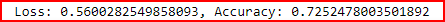

# Neural_Network_Charity_Analysis

## Project Overview

Alphabet Soup is a philantropic foundation that supports environmental initiatives, improves the well being of people's lives and helps world wide initiatives for peace and unity. They have been very effective at raising and investing in livesaving technologies and reforestation initiatives around the world to the tune of 10 billion dollars in the past 20 years. However, not every donation is impactful, some groups will take the funds and be never heard from again. To ensure that donated funds are used effectively, Alpahbet Soup's management has decided to invest in technologies that will help them to predict which organizations should receive donations versus those that are high risk.

The desire is to create a mathematical data driven solution as a tool to assist in making sound decisions. As such, Alphabet Soup management has tasked us with creating a deep learning neural network model which can take in all types of input data and provide a clear decision making result. This deep learning model will be based on a binary classification model and will be trained, tested and optimized as needed to provide the best predicted outcome based on the features in the dataset.

Deliverables:

1. Preprocessing Data for a Neural Network Model
2. Compile, Train, and Evaluate the Model
3. Optimize the Model
4. A Written Report on the Neural Network Model (README.md)

------------------------------------------------------------------------------------------------------------

## Resources

- Software: Visual Studio Code 1.56.2, Python 3.7.10, Jupyter Notebook Server 6.3.0
- Browser : Google Chrome v91.0.4472.124
- Libraries: imbalanced-learn v0.8.0, scikit-learn v0.24.2, tensorflow v2.6.0
- Google Collab Notebook

------------------------------------------------------------------------------------------------------------

## Results

- You’ll need to think about how many inputs there are before determining the number of neurons and layers in your model. Once you’ve completed that step, you’ll compile, train, and evaluate your binary classification model to calculate the model’s loss and accuracy.

### Read, Preprocess and Evaluate data

- The different features of the dataset are broken down as follows:
  - The target coefficient is the variable name 'Is_Successful'
  - The coefficient variables are:
    - Application Type
    - Affiliation
    - Classification
    - Use_Case
    - Organization
    - Status
    - Income_Amt
    - Special_Considerations
    - Ask_Amount

- The coefficients that are neither targets nor features and should likely be removed are:
  - Affiliation
  - Use_Case
  - Organization
  - Status
  - Special_Considerations

### Compile, train and Evaluate Model

-The neural network model was constructed based on 43 columns of coefficients with one output target coefficient. The construction was as follows:

- Layer 1 with 80 nodes
- Layer 2 with 30 nodes
- Activation functions used was 'relu' for the hidden layers to identify nonlinear characteristics from the input values and 'sigmoid' for the target which provides a binary result
- The target performance accuracy of 75% or greater was not attained by this model and is shown below.

- To increase model performance a number of things were attempted and annotated in the code as follows:
  - Input values were dropped
  - Nodes were reduced
  - Different activation functions were used(tanh and Softmax)
  - The second hidden layer was entirely removed
  - Compilation loss function was changed to 'mse'
  - Fit model epochs was reduced from 100 to 50

------------------------------------------------------------------------------------------------------------

## Overall Summary

In this particular case the deep learning model was not a good solution for our dataset as the results were below the 75% accuracy rate that was needed. It's likely that the model is acting upon the scale exerted by different features of the dataset. Also, overfitting might also be a concern where deep learning models can cause convergence. A recommendation would be to use a Support Vector Machine(SVM) as a possible solution to this request. SVM's can build models with linear and non-linear data and are less prone to overfitting.
